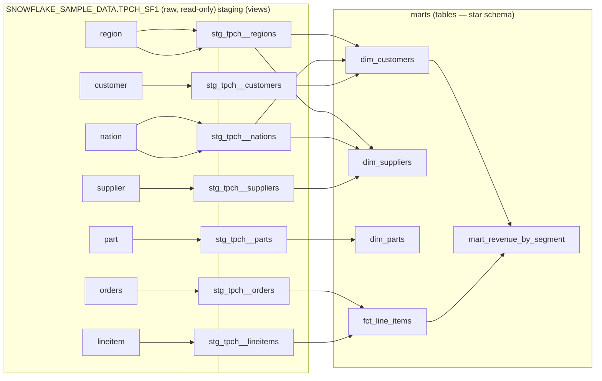
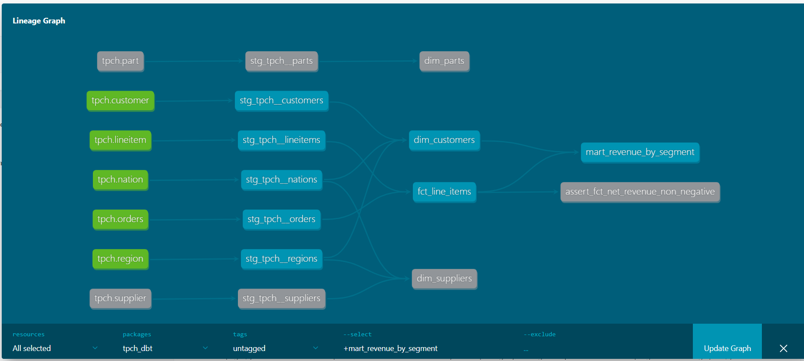

# TPC-H Analytics Warehouse — Snowflake + dbt

A dimensional data warehouse built on **Snowflake** and **dbt**, transforming the raw TPC-H benchmark dataset into a clean, tested, documented star schema ready for analytics.

This project takes seven normalized source tables and models them into staging views and a dimensional mart layer — the standard ELT pattern used in production analytics engineering. Every model is version-controlled, every transformation is a `SELECT`, and the warehouse is reproducible from a single `dbt build`.

---

## Why this project

TPC-H models a wholesale supplier's business — customers place orders, orders contain line items, line items reference parts and suppliers, and everyone belongs to a nation and region. It's normalized for transactional integrity, which makes it *bad* for analytics: answering "revenue by region and market segment" means joining five tables every time.

The job here is to reshape that normalized source into an analytics-friendly **star schema** — conformed dimensions plus a line-item fact table — so business questions become simple, fast aggregations instead of multi-table joins.

---

## Architecture



### Lineage (generated by dbt)



*Generated with `dbt docs generate`. The DAG shows raw sources flowing into staging views, then into the star-schema marts — dbt resolves this order automatically from `ref()` and `source()`.*

**Layers:**

- **Sources** — the raw TPC-H tables, declared once in `_tpch__sources.yml`. dbt tracks lineage from these forward, so it always knows which models depend on which raw table.
- **Staging** (`stg_*`, materialized as **views**) — one model per source table, 1:1. Renames cryptic columns (`c_acctbal` → `account_balance`), casts types, light cleanup. No joins. Views cost no storage and are always fresh.
- **Marts** (materialized as **tables**) — the dimensional layer. Conformed dimensions (`dim_customers`, `dim_suppliers`, `dim_parts`), a `fct_line_items` fact table at line-item grain, and a business-question mart. Materialized as tables because they're the layer analysts and BI tools query repeatedly.

---

## Tech stack

| Layer | Tool |
|---|---|
| Warehouse | Snowflake (Standard edition, X-Small warehouse) |
| Transformation | dbt Core + `dbt-snowflake` adapter |
| Language | SQL (Jinja-templated) |
| Environment | Python 3.12, managed with [uv](https://github.com/astral-sh/uv) |
| Auth | Snowflake key-pair authentication (RSA) |
| Source data | TPC-H SF1 (Snowflake sample data, read-only) |

---

## Data source

TPC-H at scale factor 1, available in every Snowflake account at `SNOWFLAKE_SAMPLE_DATA.TPCH_SF1`. It's read-only shared data, so there is **nothing to load** — dbt reads it directly. Fixed cardinalities at SF1:

| Table | Rows |
|---|---|
| region | 5 |
| nation | 25 |
| supplier | 10,000 |
| customer | 150,000 |
| part | 200,000 |
| orders | 1,500,000 |
| lineitem | ~6,000,000 |

---

## Models

Twelve models build in dependency order: seven staging views, then the star schema. Row counts below are from an actual `dbt run` against SF1 — they double as a correctness check. `dim_customers` landing at exactly 150,000 confirms the nation/region joins neither dropped nor duplicated rows, and `fct_line_items` at 6,001,215 confirms every line item matched a valid order.

| Model | Layer | Materialization | Rows |
|---|---|---|---|
| `stg_tpch__*` (7 models) | staging | view | mirror of source |
| `dim_customers` | mart | table | 150,000 |
| `dim_suppliers` | mart | table | 10,000 |
| `dim_parts` | mart | table | 200,000 |
| `fct_line_items` | mart | table | 6,001,215 |
| `mart_revenue_by_segment` | mart | table | 25 |

`mart_revenue_by_segment` returns 25 rows = 5 regions × 5 market segments. Because the fact is at line-item grain, order counts in the mart use `count(distinct order_key)` — the same order spans multiple line-item rows, so a plain count would overcount.

The full run builds all 12 models in ~11 seconds on an X-Small warehouse, including the ~6M-row fact table in under 6 seconds — a practical demonstration of Snowflake's separation of compute and storage.

---

## Findings

Querying the star schema at SF1 returns **$218.10B in net revenue across 1,500,000 orders and 6,001,215 line items**. TPC-H is a synthetically generated benchmark, so the honest headline is that the data is *near-uniformly distributed* — and stating that plainly is more useful than inventing a market narrative a 2% spread wouldn't support.

Net revenue by region (top to bottom spans ~2%):

| Region | Net revenue | Orders |
|---|---|---|
| Europe | $44.03B | 303,286 |
| Asia | $43.86B | 301,740 |
| America | $43.57B | 299,103 |
| Africa | $43.49B | 298,994 |
| Middle East | $43.16B | 296,877 |

Net revenue by market segment is equally flat — Building ($44.14B) to Automobile ($43.28B). The single largest region × segment cell is **America / Building at $9.07B**.

Line-item return status: 50.7% not yet received (`N`), 24.6% returned (`R`), 24.6% accepted (`A`).

**What the numbers actually validate:** the modeled totals reconcile exactly to source (6,001,215 line items, 1,500,000 orders), and revenue distributes as a uniform generator should. That reconciliation — not a manufactured insight — is the point: it confirms the joins, grain, and aggregations are correct end to end. The value of this project is a *tested, correct pipeline*, not a discovery in fictional data.

---

## Project structure

```
tpch-dbt-project/                     # repo root
├── .venv/                            # uv virtual environment (gitignored)
├── .gitignore
├── README.md
└── tpch_dbt/                         # dbt project
    ├── models/
    │   ├── staging/
    │   │   ├── _tpch__sources.yml       # raw source declarations
    │   │   ├── _stg_tpch__models.yml     # staging tests + docs
    │   │   ├── stg_tpch__customers.sql
    │   │   ├── stg_tpch__orders.sql
    │   │   ├── stg_tpch__lineitems.sql
    │   │   ├── stg_tpch__parts.sql
    │   │   ├── stg_tpch__suppliers.sql
    │   │   ├── stg_tpch__nations.sql
    │   │   └── stg_tpch__regions.sql
    │   └── marts/
    │       ├── _marts__models.yml     # mart tests + docs
    │       ├── dim_customers.sql
    │       ├── dim_suppliers.sql
    │       ├── dim_parts.sql
    │       ├── fct_line_items.sql
    │       └── mart_revenue_by_segment.sql
    ├── analyses/ · macros/ · seeds/ · snapshots/ · tests/   # dbt scaffolding
    └── dbt_project.yml
```

> Two files are intentionally **not** committed: `.venv/` (the virtual environment, recreated with `uv`) and `profiles.yml` (lives at `~/.dbt/profiles.yml` because it holds connection secrets). Both are covered by `.gitignore`. Run `dbt` commands from inside `tpch_dbt/`.

---

## Setup and reproduction

### Prerequisites

- A Snowflake account ([free 30-day trial](https://signup.snowflake.com/), no credit card)
- [uv](https://github.com/astral-sh/uv) installed
- OpenSSL (bundled with Git for Windows; native on macOS/Linux)

### 1. Install dbt

```bash
uv python install 3.12
uv venv --python 3.12
source .venv/bin/activate      # Windows: .venv\Scripts\activate
uv pip install dbt-snowflake
dbt --version
```

### 2. Set up key-pair authentication

Snowflake is deprecating single-factor password logins, so this project uses RSA key-pair auth (the correct approach for any automated dbt run).

Generate a key pair **outside the repo directory**:

```bash
openssl genrsa 2048 | openssl pkcs8 -topk8 -inform PEM -out rsa_key.p8 -nocrypt
openssl rsa -in rsa_key.p8 -pubout -out rsa_key.pub
```

Register the public key on your Snowflake user (in a Snowsight worksheet):

```sql
ALTER USER <your_username> SET RSA_PUBLIC_KEY='<body of rsa_key.pub, no BEGIN/END lines>';
```

### 3. Create the target objects in Snowflake

```sql
USE ROLE SYSADMIN;

CREATE WAREHOUSE IF NOT EXISTS COMPUTE_WH
  WAREHOUSE_SIZE = 'XSMALL' AUTO_SUSPEND = 60 AUTO_RESUME = TRUE INITIALLY_SUSPENDED = TRUE;

CREATE DATABASE IF NOT EXISTS TPCH_DBT;
CREATE SCHEMA IF NOT EXISTS TPCH_DBT.DBT_DEV;
```

### 4. Configure the dbt profile

Create `~/.dbt/profiles.yml` (use the hyphenated `ORG-ACCOUNT` identifier, never the dotted form):

```yaml
tpch_dbt:
  target: dev
  outputs:
    dev:
      type: snowflake
      account: "<ORGNAME-ACCOUNT_NAME>"
      user: "<your_username>"
      private_key_path: "<full/path/to/rsa_key.p8>"
      role: SYSADMIN
      warehouse: COMPUTE_WH
      database: TPCH_DBT
      schema: DBT_DEV
      threads: 4
```

### 5. Verify and build

```bash
dbt debug          # expect: All checks passed!
dbt build          # runs models + tests in dependency order
dbt docs generate  # build the docs site
dbt docs serve     # explore lineage + docs in the browser
```

---

## Data quality

Models are tested with dbt's built-in tests — `unique` and `not_null` on primary keys, and `relationships` tests enforcing referential integrity between fact and dimension tables (e.g. every `customer_key` in `fct_line_items` exists in `dim_customers`). Tests run as part of `dbt build` and gate the pipeline: if an assumption breaks, the build fails.

---

## Build status

> Active build — remove this section when complete.

- [x] Snowflake account + key-pair auth + target objects
- [x] dbt project scaffolded, `dbt debug` passing
- [x] Staging layer (7 models)
- [x] Marts layer (star schema — 3 dims, 1 fact, 1 business mart)
- [x] Tests + documentation (43 build steps passing: 12 models, 31 tests)
- [ ] Lineage screenshot + repo pushed public

---

## License

MIT